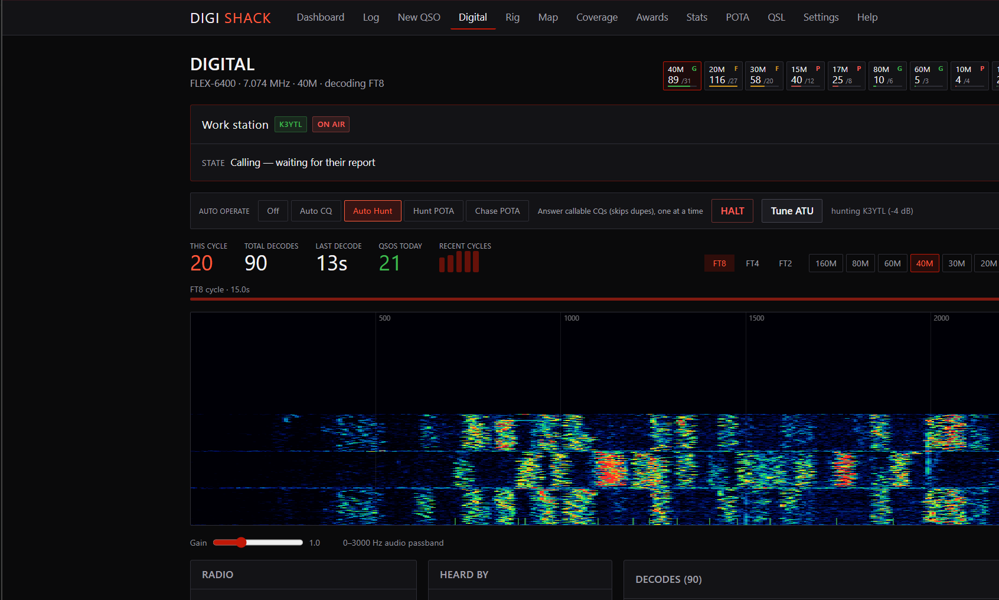
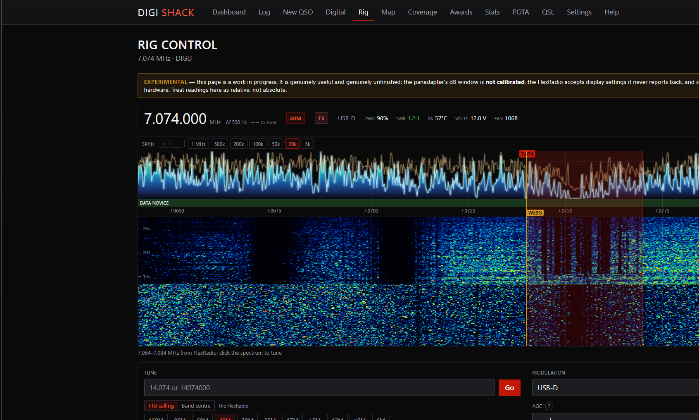
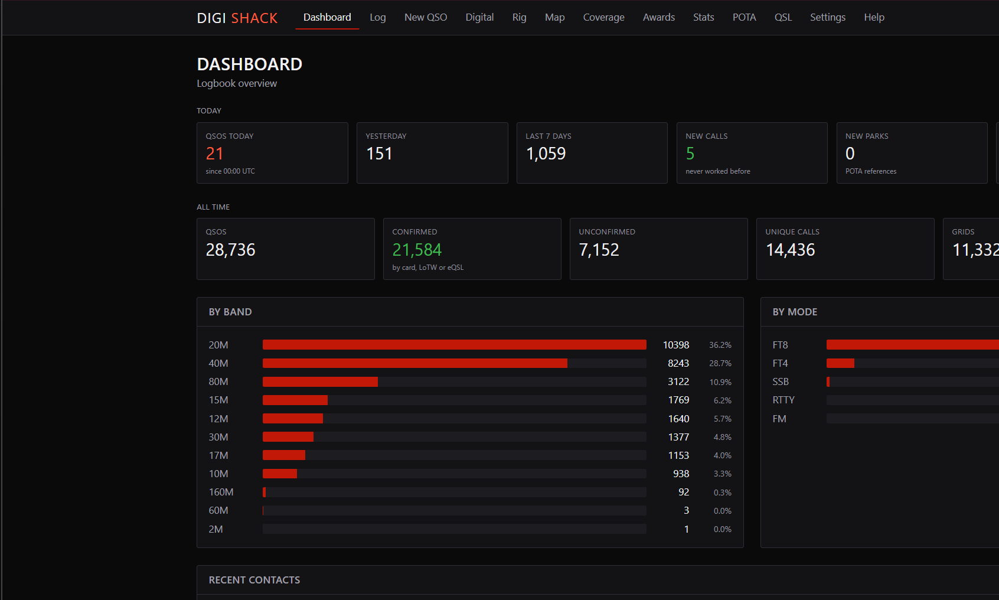

# DigiShack

Web-based amateur radio logging platform. A Cloudlog-parity logbook with native
FT4/FT8 support and FlexRadio control.

Digital modes run one of three ways, chosen by the `digital.source` setting:

- **`flex`** — fully self-contained. DigiShack pulls DAX audio from a FlexRadio
  over VITA-49 and decodes FT8/FT4 in-process. No external decoder.
- **`icom`** — the same, over the RS-BA1 network protocol to an IC-7300, IC-705,
  IC-9700 or IC-7610. No virtual audio cable, no virtual COM port.
- **`wsjtx`** — takes decodes from an external decoder (WSJT-X, JTDX,
  wsjtx-omega) over its UDP protocol, for setups that prefer one.

## What it does

A complete station in one application — logging, digital modes, rig control and the
QSL side — rather than a logbook that talks to other programs.

**Logging.** DXCC-aware logbook with ADIF import and export, duplicate checking
against band and mode, a triage view for contacts missing data, and award progress for
DXCC, WAS, WAZ, WAC, VUCC and POTA. Grid-square and worked-coverage maps drawn from
vendored coastlines, so they work with the uplink down.

**Digital modes.** FT8, FT4 and FT2 decoded and transmitted in-process — no external
decoder, no virtual audio cable, no virtual COM port. Live waterfall, per-decode award
scoring, and click-to-call sequencing that runs the whole exchange and logs it.

**Automatic operating.** Call CQ, hunt callable CQs, hunt POTA activators, or chase
them across bands from the spot feed. An operating schedule decides what runs when,
with sleeping hours and a PA duty-cycle rest. Every transmission passes safety brakes:
duplicate suppression, a runaway stop, a dead-receiver guard, SWR and PA-temperature
cutouts, and a wall-clock session limit.

**Rig control.** CAT panel, RF panadapter with click-to-tune, receiver audio in the
browser, and a voice mode that closes the digital path and hands the radio back.

**QSL.** Rendered cards from your own artwork, an email queue you review before
anything sends, and handling for addresses that are not ordinary mailboxes — Winlink's
accept-list key, arrl.net's forwarder, and the `mycall@` placeholder convention.

**Logbook services.** LoTW upload and download, QRZ, eQSL, Club Log, and
Cloudlog/Wavelog. PSKReporter spot upload and band-condition figures. Email alerts when
the station faults.

## Screenshots

Live station, mid-session — not mock-ups.

**Digital** — FT8 running unattended. Auto Hunt is working a station while the next
caller waits in the call-back queue; the band strip along the top is what the whole
PSKReporter network is hearing per band, against what this receiver is actually
decoding.



**Rig control** — the RF panadapter, with the band plan under the ruler, spotted
callsigns marked on frequency, the receive passband shaded, and click-to-tune.



**Dashboard** — today against yesterday and the week, what was worked that had never
been worked before, and the all-time totals.



## Documentation

Full documentation is in **[docs/](docs/)**:

| | |
|---|---|
| [Getting started](docs/getting-started.md) | Install, first run, first contact |
| [Operating](docs/operating.md) | Automatic modes, the safety brakes, FT-0, band conditions |
| [Digital modes](docs/digital-modes.md) | FT8/FT4/FT2, the DAX path, transmitting |
| [POTA](docs/pota.md) | Chasing, n-fers, importing your hunter log |
| [QSL](docs/qsl.md) | Cards, templates, the emailer |
| [Backup and moving](docs/backup-and-moving.md) | Bundles, restore, the two traps that break a migration |
| [Settings reference](docs/settings.md) | Every setting, generated from the code |
| [Architecture](docs/architecture.md) | What runs where, and why |
| [Troubleshooting](docs/troubleshooting.md) | Symptoms in the order you meet them |
| [Development](docs/development.md) | Conventions, the test suite, adding things |

## Stack

| Layer | Choice |
|---|---|
| Framework | Next.js 16, **Pages Router** |
| DB / ORM | MySQL + Prisma |
| Jobs / queues | BullMQ + Redis |
| Process manager | PM2 (no Docker) |
| Reverse proxy | NGINX |
| Realtime | WebSocket (`ws`) for the live decode feed |
| Theme | Permanent dark mode, red accent `#c21807`, Oswald |

There is no `app/` directory and no App Router. Don't add one.

## Setup

Requires Node 20+, MySQL 8+, and (from Phase 2 onward) Redis.

Create the database first:

```sql
CREATE DATABASE digishack CHARACTER SET utf8mb4 COLLATE utf8mb4_unicode_ci;
CREATE USER 'digishack'@'localhost' IDENTIFIED BY 'a-real-password';
GRANT ALL PRIVILEGES ON digishack.* TO 'digishack'@'localhost';
FLUSH PRIVILEGES;
```

Then run the installer. It creates `.env`, generates `SETTINGS_KEY`, installs
dependencies, migrates, builds and starts PM2 — and is safe to re-run:

```bash
./scripts/install.sh
```

It stops and tells you to edit `DATABASE_URL` if `.env` is still the example.

<details>
<summary>Manual equivalent</summary>

```bash
cp .env.example .env
# set DATABASE_URL, and SETTINGS_KEY=$(openssl rand -hex 32)
npm install               # runs `prisma generate` via postinstall
npm run db:migrate        # dev: creates the initial migration
# or against an already-migrated database:
npm run db:deploy
```
</details>

To upgrade later, either from the **/update** page in the app (see
[Updating](#updating)) or from a shell:

```bash
./scripts/update.sh              # pull, migrate, build, reload
./scripts/update.sh --backup     # mysqldump first
./scripts/update.sh --no-pull    # already updated by other means
```

`update.sh` refuses to run with a dirty working tree, skips `migrate deploy` when
the schema is already current, and reloads PM2 rather than restarting it so
in-flight requests aren't dropped.

Optionally load sample data so the dashboard and log filters have something to
show (a station, three operators and ~60 QSOs across bands, modes and
QSL states):

```bash
npm run db:seed
```

```bash
npm run dev               # http://localhost:3000
```

First run redirects to **/setup**, which creates the initial ADMIN account and
then closes itself permanently. After that, create a station on **/stations**
before logging — every QSO is attributed to one (the seed script creates one for
you).

> The seed deliberately creates **no user account**. Logins come only from
> `/setup`, because seeding an admin with a known password would commit a working
> credential to version control.

### Useful scripts

| Script | Does |
|---|---|
| `npm run dev` | Next dev server |
| `npm run build` / `npm start` | Production build / serve |
| `npm run typecheck` | `tsc --noEmit` |
| `npm run check` | typecheck + all assertion suites |
| `npm run check:adif` | ADIF writer/parser assertions — run after touching `lib/adif/` |
| `npm run check:dxcc` | cty.xml parser + callsign resolution assertions |
| `npm run check:wsjtx` | WSJT-X protocol assertions (byte-level) |
| `npm run bridge` | Run the digital bridge in the foreground (either source) |
| `npm run db:migrate` | `prisma migrate dev` |
| `npm run db:deploy` | `prisma migrate deploy` |
| `npm run db:seed` | Dev sample data — station, operators, ~60 QSOs |
| `npm run db:studio` | Prisma Studio |
| `npm run db:validate` | Validate the schema |

## Production

```bash
npm ci && npm run build
pm2 start ecosystem.config.js
pm2 save && pm2 startup
```

NGINX config lives in [`deploy/nginx/digishack.conf`](deploy/nginx/digishack.conf).

### Proxmox

[`deploy/proxmox/digishack-lxc.sh`](deploy/proxmox/digishack-lxc.sh) builds a container
and installs into it. Run it **on the Proxmox host**:

```bash
bash deploy/proxmox/digishack-lxc.sh
bash deploy/proxmox/digishack-lxc.sh --ctid 141 --hostname shack --cores 4
```

It fetches a Debian 12 template if needed, creates an unprivileged LXC with nesting on,
installs Node 20, MariaDB and PM2, clones the repo, creates the database, and then hands
over to `scripts/install.sh` — the same installer a bare-metal install uses, so there is
only one install path to keep working. It refuses to touch an existing CTID.

Two things are specific to running in a container, and the script says both when it
finishes:

- **The clock is the host's clock.** A container cannot set its own time, and FT8
  tolerates about a second of error before decoding degrades and nobody decodes you —
  which reads exactly like a dead band. Fix NTP on the *host*.
- **FlexRadio discovery uses multicast**, which containers are bad at. Set `flex.host`
  explicitly and leave auto-discovery off. A networked Icom is unaffected: plain unicast
  UDP to an address you configure.

`ecosystem.config.js` defines two processes: `digishack-web` and
`digishack-bridge`. The bridge is separate on purpose — it binds a UDP socket, and
a bound UDP socket can't be shared across cluster workers. Keeping it out of the
web tier is what allows the web tier to scale.

> **Both processes must stay at `instances: 1`.** The bridge because of the UDP
> socket; the web tier until realtime fan-out moves to Redis pub/sub.

## Project layout

```
pages/            routes + API (Pages Router)
  api/qsos/       QSO CRUD, dupe check
  api/stations/   station CRUD
  api/operators/  operator CRUD
  api/stats/      dashboard counters
components/       ui primitives, layout shell, QSO form
lib/
  api/respond.ts  BigInt-safe JSON, method routing, error translation
  client/api.ts   fetch helpers + useApi hook
  db/             Prisma client, QSO query builders
  ham/            band plan + mode tables
  validation/     zod schemas
  time.ts         UTC <-> datetime-local conversion
prisma/           schema
deploy/nginx/     reverse proxy config
```

## Configuration

**Only three values live in `.env`:**

| | Why it can't move |
|---|---|
| `DATABASE_URL` | Settings are stored in the database, so its own credentials can't be |
| `SETTINGS_KEY` | The key that decrypts those settings can't itself be encrypted |
| `PORT` | Needed before the app can query anything |

Everything else — QRZ, LoTW, eQSL, ClubLog, HRDLOG, SMTP, PSKReporter, the
bridge — is managed at **/settings** (ADMIN only) and stored in the `Setting`
table, with secrets encrypted using **AES-256-GCM**. GCM rather than CBC because
it authenticates as well as encrypts: a tampered ciphertext fails to decrypt
instead of yielding plausible garbage that then gets sent to a remote service as
a password.

Add a new setting by adding an entry to
[`lib/settings/registry.ts`](lib/settings/registry.ts) — that file is the
definitive list, and the UI and API are both generated from it. Read one with
`getSetting()` / `getSecret()` / `getNumberSetting()` / `getBooleanSetting()`.

Resolution order is **database → `envFallback` → registry default → null**. The
`envFallback` exists purely as a migration path for installs that predate the
Settings UI; the Settings page flags anything still coming from `.env` so it's
visible what's left to move.

### Rules

- **`SETTINGS_KEY` must never change on a live install.** Every encrypted row is
  tied to it. `install.sh` will not overwrite an existing one. Back it up
  alongside the database — a database backup without it is undecryptable.
- **Plaintext secrets are never sent to the browser.** The API returns
  `••••••1234` and a source label, nothing more.
- **A blank secret field means "unchanged", not "empty".** The browser never has
  the current value, so blank cannot mean clear. Clearing is explicit, via the
  Clear button (which sends `null`).
- **A row that won't decrypt is treated as unset, not as a reason to fall back to
  `.env`.** Quietly using a different credential than the one the UI displays
  would be worse than having none.
- Without a valid `SETTINGS_KEY` the app still runs; secrets simply can't be
  stored, and /settings says so prominently.

## Updating

**/update** (ADMIN) shows the running version, how many commits behind the branch
is, and what would be deployed. One button runs
`git merge --ff-only` → `npm ci` → `prisma migrate deploy` → `npm run build` →
`npm run check` → `pm2 reload`, streaming each step's output.

**This is remote code execution, so `update.allowFromUi` defaults to `false`.**
Upgrading DigiShack never silently adds a deploy path to an existing install — an
operator has to enable it, and the toggle is on the /update page with the risk
stated beside it.

The safeguards are deliberate, and worth not removing:

- **ADMIN only** on every endpoint; a VIEWER cannot read the status.
- **Refuses a dirty working tree**, so local edits are never clobbered.
- **`--ff-only`** — no merge commits, no history rewriting, and a diverged branch
  is refused rather than reconciled.
- **A failed install, migration or build aborts before the reload**, so a broken
  build never becomes the running version.
- **The token never leaks.** Encrypted at rest; written to a `0600` temp file only
  for the duration of a fetch and removed in a `finally`. It is deliberately *not*
  placed in the remote URL (that persists it into `.git/config`) nor passed via
  `-c` (visible in the process list to every user on the machine). It is also
  redacted from captured output before that output can reach a log or a browser.

Run state persists to `logs/update-state.json` because the reload kills the process
performing the update — the UI polls through the restart and picks the outcome back
up. `scripts/update.sh` remains available and additionally supports `--backup`.

## DXCC reference data

`Qso.dxcc` holds an ADIF entity code. Resolving a callsign to one needs reference
data, loaded from **Club Log's cty.xml** at **/dxcc** (ADMIN) — either fetched with
a cty API key or uploaded by hand for a shack with no outbound internet.

**Nothing is committed to the repo.** The file is maintained upstream, changes
regularly, and is not ours to redistribute. Refresh it every month or two.

Club Log's file is used rather than AD1C's `cty.dat` because `cty.dat` carries a
country name and primary prefix but **not** the numeric ADIF entity code, which is
the one value `Qso.dxcc` needs.

### It is not a prefix table

[`lib/dxcc/resolve.ts`](lib/dxcc/resolve.ts) handles all of these, and a naive
lookup gets every one of them wrong:

| Input | Resolves to | Why |
|---|---|---|
| `KH6XYZ` | Hawaii (110) | not the USA, despite the `K` |
| `KL7AA` | Alaska (6) | ditto |
| `VP2E/K9XYZ` | Anguilla (12) | portable prefix beats the home call |
| `K9XYZ/KH6` | Hawaii (110) | suffix form of the same rule |
| `F/K9XYZ` | France (227) | tie broken toward the shorter token |
| `K9XYZ/P` | USA (291) | `/P`, `/M`, `/QRP`, bare digits are not locations |
| `K9XYZ/MM` | *no entity* | maritime mobile is outside every entity |
| `YU1ABC` in 1995 | Yugoslavia (296) | deleted entity, valid at the time |
| `YU1ABC` in 2026 | Serbia (501) | same prefix, different era |

Precedence is whole-callsign exception, then longest matching prefix, each filtered
by validity at the QSO date. **Always pass the QSO's own date** — resolving a 1995
contact against today's table credits the wrong entity.

Import safety: `dxcc.importedAt` is deleted before an import starts and written
only on success, and the resolver treats its absence as "no data". A failed or
interrupted import therefore yields "not loaded" rather than answers drawn from
half a table.

## Digital modes: the bridge

[`services/radio`](services/radio/index.ts) is DigiShack's own radio engine — the
self-contained decode/transmit paths for a FlexRadio (`digital.source = flex`) and
a networked Icom (`digital.source = icom`). It can also take decodes from an
external decoder over the WSJT-X UDP protocol (`digital.source = wsjtx`) for
setups that prefer one. Run it with `npm run radio`, or under PM2 as
`digishack-bridge`.

It was called the "omega bridge" until 1.5.0, after wsjtx-omega. That is one
program it can take decodes *from*; it has nothing to do with the two radios the
bridge drives itself, and the name made every setting read as though an external
program were always involved. The bridge's own settings are `bridge.*` now and the
external-decoder ones `wsjtx.*`; the old keys are still read when the new ones are
unset.

It listens for Heartbeat/Status/Decode/QSOLogged, persists decodes to
`DigitalDecode`, optionally auto-logs QSOs, broadcasts everything to browsers on
`ws://…/ws/decodes`, and exposes a control API so the web app can send
Reply / HaltTx / HighlightCallsign back to the decoder.

Point the decoder's UDP server at this host on `wsjtx.udpPort` (WSJT-X defaults
to 2237).

### Rules

- **The bridge must stay at `instances: 1`.** It binds a UDP socket, and a bound
  UDP socket cannot be shared across cluster workers — a second instance either
  fails to bind or silently steals half the datagrams. This is also why it is a
  separate process rather than living inside Next.js.
- **The control API is never proxied by NGINX.** `/reply`, `/halt`, `/free-text`
  and friends make the radio transmit. The web app reaches them over localhost with
  `bridge.token`; without that token the control API refuses to start serving
  and says so.
- **`wsjtx.autoLog` defaults to off.** Writing to the log because a radio said so
  is opt-in.
- Decodes are **batched** before insert — one FT8 cycle yields 30+ in the same
  instant.
- A decode whose band can't be resolved reaches the live feed but is **not**
  persisted. `DigitalDecode.band` is required and a guessed band is worse than none.
- **Every decode can also go to a CSV per UTC day** — set `digital.decodeCsvDir`.
  Separate from the database copy, which is pruned after
  `digital.decodeRetentionDays`: the table is what the application queries, the files
  are the raw feed kept in a format that outlives the schema. Includes decodes with no
  resolvable band, which never reach the database at all.
- **A contact made by the native path keeps its whole exchange** in `Qso.transcript`
  — every message sent and received, with times, reports, offsets and any
  transmission the radio refused. See [`lib/digital/transcript.ts`](lib/digital/transcript.ts).
  Null on manual entries, ADIF imports and anything logged through an external
  decoder: those never saw the messages, so null means "not recorded" rather than
  "nothing was said".

### Protocol notes

[`lib/wsjtx/protocol.ts`](lib/wsjtx/protocol.ts) is Qt `QDataStream`, big-endian:
magic `0xadbccbda`, schema, type, then an id string and typed fields. Strings are a
`quint32` byte length (`0xffffffff` = null) then UTF-8.

Three things that are easy to get wrong, all asserted in `npm run check:wsjtx`:

- **QDateTime carries a trailing offset.** After the Julian day, ms and timespec
  byte, a timespec of `2` (OffsetFromUTC) adds a `qint32`. Skipping it shifts every
  subsequent field in a QSOLogged packet — the original decoder did exactly that.
- **Delta Frequency is not optional.** It sits between delta time and mode in a
  Decode, and it is what `DigitalDecode.freqOffset` stores.
- **QColor is six 16-bit values after a spec byte**, with 8-bit components scaled
  by `0x101` — needed for HighlightCallsign.

WSJT-X reports FT4 as `MODE=MFSK`; the bridge normalises that to `FT4` before
logging, because that is what the operator calls it.

## Public API

**`/api/v1`** is the stable surface for third-party clients. Everything outside it
is app internals and may change without notice — that separation is the point of
versioning it.

`GET /api/v1` returns a machine-readable list of every endpoint, its required
role, and the conventions. Start there rather than in this README.

```bash
curl -H 'Authorization: Bearer dsk_…' https://host/api/v1

# Ingest ADIF — the endpoint WSJT-X-adjacent tools should post to
curl -X POST -H 'Authorization: Bearer dsk_…' -H 'Content-Type: text/plain' \
  --data-binary @log.adi 'https://host/api/v1/adif?stationId=…'
```

Keys are managed at **/api-keys** (ADMIN). The token is shown **once** — only its
SHA-256 is stored.

### Rules that must not be relaxed

- **A key can never hold ADMIN.** The API rejects it. A leaked key that reaches
  user management or the updater is categorically worse than one that logs a QSO.
- **Bearer tokens work only on `/api/v1`.** Every other route is cookie-only; a
  route opts in explicitly with `allowApiKey: true` on its `MethodSpec`. Don't add
  that flag to anything under `/api/users`, `/api/settings`, `/api/update` or
  `/api/api-keys`.
- **Keys cannot mint keys** — `/api-keys` is cookie-only, so a leaked VIEWER token
  can't be escalated.
- **Revoking is immediate**: `active` and `expiresAt` are checked on every request.
- Session auth is tried before key auth, so a browser request is never attributed
  to a key that happens to be in the headers.

New public endpoints should share their implementation with the app's own route
(see [`lib/adif/import-service.ts`](lib/adif/import-service.ts) and
[`lib/stats/summary.ts`](lib/stats/summary.ts)) rather than reimplementing it — a
second copy drifts.

## External logbook services

`GET /api/integrations/status` runs **read-only** credential checks. Nothing there
writes to a remote logbook, which is what makes it safe against live accounts.

| Service | Implemented | Notes |
|---|---|---|
| QRZ Logbook | status, full import, single insert | `qrz.logbookApiKey` is per-logbook and **separate** from the XML login |
| LoTW | confirmation download | upload needs TQSL to sign each QSO; there is no password path |
| eQSL / ClubLog / HRDLOG | — | no read-only probe exists, so they are not probed |

**ClubLog authenticates by registered email address, not callsign**, and prefers an
Application Password over the account password.

### Rules

- **Nothing bulk-uploads to a remote logbook.** These are live public logs;
  pushing local QSOs outward en masse is very hard to unpick, especially on LoTW.
  `insertQrzQso` handles one explicitly chosen QSO — do not call it in a sweep.
- **Sync endpoints default to `dryRun`.** The first thing an operator should see is
  what *would* change.
- **LoTW sync only ever sets `lotwRcvd` true.** A confirmation missing from an
  incremental window is not evidence it was withdrawn.
- Matching is to the **minute**, not the second — LoTW and ADIF both record
  `TIME_ON` that coarsely.

### Importing an existing QRZ logbook

```bash
curl -X POST -b cookies \
  'http://localhost:3000/api/integrations/qrz-import?stationId=…&dryRun=0&maxPages=12'
```

Paging uses `AFTERLOGID`, which is undocumented. Determined empirically: it
returns **ascending** logid order and is **inclusive** of the id given, so each
page repeats the previous page's last record — one `alreadyInLog` per page, which
dedupe absorbs. `MAX:5000` is accepted.

> **Never use `z.coerce.boolean()` for a query parameter.** It applies JavaScript
> `Boolean()` semantics, so `?dryRun=0` means **true**. Use `boolQuery()` from
> [`lib/validation/query.ts`](lib/validation/query.ts). This silently turned a real
> import into a no-op that reported success.

## Awards

**/awards** tracks DXCC, WAS, WAZ, WAC, grid squares and IOTA — worked vs
confirmed, what's missing, and a per-band and per-mode matrix for each.

**"Confirmed" means confirmed by any method** — card, LoTW or eQSL. That is the
same definition [`lib/db/qso.ts`](lib/db/qso.ts) uses for the log's confirmed
filter, and the two must not drift apart.

Each award keys off one ADIF field, which is why they are stored:

| Award | Field | Denominator |
|---|---|---|
| DXCC | `dxcc` | current (non-deleted) entities from cty.xml |
| WAS | `state` | 50 US states |
| WAZ | `cqZone` | 40 CQ zones |
| WAC | `continent` | 7 continents |
| Grid squares | `gridSquare` | **none** |
| IOTA | `iota` | **none** |

Grid and IOTA have no denominator on purpose. The IOTA reference is ~1,200 groups
maintained by the RSGB programme and isn't bundled, so progress reads "groups
worked" rather than "N of M" — inventing a denominator would be worse than omitting
one.

If more has been worked than the reference data contains — a partial or stale
cty.xml — the award sets `totalUnreliable`, hides the fraction and says so. The
count stays correct; only the denominator is untrustworthy.

`cqZone` and `continent` are filled from the DXCC lookup on the entry form and by
the `/dxcc` backfill, because WAZ and WAC are otherwise unreachable.

## Authentication

Every page and every API route requires a session. The only public endpoints are
`/api/auth/{setup,login,logout,me}`.

**`User` is the login identity; `Operator` is the QSO-attribution record.** They
are separate on purpose — an `Operator` is scoped to exactly one `Station`, so
credentials on `Operator` would force anyone operating two stations to hold two
logins. `Operator.userId` optionally links them; guest ops can be logged without
having an account at all.

**`User.role` is authoritative for authorization. `Operator.role` is not** — it
describes that person's function at that station and is never consulted for
access control.

| Role | Can |
|---|---|
| `VIEWER` | Read everything. No mutations at all. |
| `OPERATOR` | Log and edit QSOs, stations, operators. |
| `ADMIN` | Everything, plus user management and destructive deletes. |

Roles are a ladder, so a `VIEWER`-marked GET is reachable by all three. Read
methods are `VIEWER` and mutations `OPERATOR`, which is what makes `VIEWER` a
genuinely read-only account rather than one enforced by convention.

Guard helpers:

- API routes — `authedRoute({ GET: { role: "VIEWER", handler }, ... })` from
  [`lib/auth/guard.ts`](lib/auth/guard.ts). **Use this, not `route()`**, for
  anything other than the four public auth endpoints.
- Pages — `export const getServerSideProps = withPageAuth({ role: "OPERATOR" })`.
  Server-side, so a protected page never renders without a valid session.
- UI role-gating — `useCan("OPERATOR")` from
  [`lib/client/session.tsx`](lib/client/session.tsx). This only hides controls;
  it is not a security boundary.

### Implementation notes

**Passwords use `scrypt` from `node:crypto`,** not argon2 or bcrypt. Both
alternatives are native modules needing per-platform prebuilt binaries, and this
repo is authored on Windows and deployed on Linux — a failed native rebuild on
deploy takes down login. scrypt is memory-hard, on OWASP's accepted list, and
ships in Node core. Parameters are stored inside each hash, so raising them later
keeps old hashes verifiable (see `needsRehash`) and logins upgrade opportunistically.

**Sessions are server-side rows, not JWTs.** That is the whole reason for the
choice: disabling an account or changing a password revokes existing sessions
*immediately*. Only the SHA-256 of the token is stored, so a database leak yields
no usable sessions.

**Login is throttled in-process** ([`lib/auth/throttle.ts`](lib/auth/throttle.ts)).
Per-process is correct while the web tier runs at `instances: 1`; if it is ever
clustered this must move to Redis, or the effective limit multiplies by the worker
count.

**Wrong email, wrong password and disabled account all return the same 401,** and
a missing account is verified against a dummy hash so it costs the same ~100ms.
Neither the message nor the timing reveals which addresses are registered.

**The last active admin cannot be demoted, disabled or deleted** — that would lock
everyone out with no recovery short of editing the database by hand.

## Conventions worth knowing before editing

**Everything is UTC.** `<input type="datetime-local">` works in local time, so
every conversion goes through [`lib/time.ts`](lib/time.ts). Getting this wrong
puts the log hours off and breaks LoTW matching outright.

**Never `res.json()` a payload containing a QSO.** `freqHz` is a Prisma `BigInt`
and `res.json()` throws on it. Use `sendJson()` from
[`lib/api/respond.ts`](lib/api/respond.ts), which serializes BigInt as a JSON
number (amateur frequencies top out around 2.5e11 Hz, well inside
`Number.MAX_SAFE_INTEGER`).

**Frequency is authoritative; band is derived.** `POST /api/qsos` accepts an
optional `band` and fills it from `freqHz` when absent. If both are supplied and
disagree, the request is rejected rather than guessed at — a band that doesn't
match its frequency silently corrupts per-band award tracking.

**Band and mode names are ADIF 3.x values**, not a contest-only set.
This matters for ADIF import/export, LoTW, and award tracking. FT4 is stored as
`FT4` even though ADIF encodes it as `MODE=MFSK` / `SUBMODE=FT4`; the Phase 2
ADIF writer is responsible for that split. See [`lib/ham/`](lib/ham/).

**Stations can't be deleted while they hold QSOs** (409). Operators can be —
`Qso.operator` is `onDelete: SetNull`, so deleting an operator detaches them from
their contacts instead of destroying log rows.

## Build status

Phases 1, 3, 4 and 5 are implemented. Phase 2 is most of the way there — what
remains is listed below, and it is all logbook plumbing rather than radio work.

- [x] Phase 1 — schema, QSO/station/operator/rig CRUD, dashboard, log view
- [x] Authentication — users, roles, sessions, first-run setup (not a numbered
      spec phase; added because DigiShack is web-facing)
- [ ] Phase 2 — Cloudlog parity
  - [x] Manual QSO entry
  - [x] ADIF import/export
  - [x] DXCC entity resolution (Club Log cty.xml)
  - [x] DXCC / WAS / WAZ / WAC / grid / IOTA award tracking
  - [x] Public REST API (`/api/v1`) with API keys
  - [x] QRZ logbook sync (status, full import) and LoTW confirmation download
  - [ ] LoTW upload (needs TQSL), eQSL, ClubLog, HRDLOG
  - [ ] QSO map, DX cluster
  - [x] CAT control panel (`/rig`)
  - [x] QSL card management (`/qsl/cards`)
- [x] Phase 4a — WSJT-X UDP bridge (protocol, persistence, auto-log, WebSocket, control API)
- [x] Phase 4c — self-contained FT8/FT4 decode from FlexRadio DAX audio (receive)
- [x] Phase 4d — self-contained FT8/FT4 **transmit** over DAX TX (verified on air:
      242 PSKReporter reception reports across NA/EU/SA from one CQ)
- [x] Phase 4e — automated operating modes on top of the native TX/RX chain:
  - [x] Auto CQ — call CQ on a clear frequency, work whoever answers, log, repeat
  - [x] Auto Call — click any decode row and the sequencer runs the full QSO
  - [x] Auto Hunt — work callable CQs one at a time (dupe/cooldown guarded);
        live-verified: W4PSK and SP1ABC (DX) logged back-to-back autonomously
  - [x] Auto Hunt POTA — hunt restricted to stations calling CQ POTA
  - [x] Auto Call POTA — click a POTA activator's decode (spot-feed retuning to
        activators you can't hear yet is still to come)
  - [x] Award-aware hunting: ranks by new DXCC / band slot / CQ zone / continent
        / grid, with signal strength only as a tiebreaker
  - [x] Chase POTA — retunes to spotted activators from the POTA spot feed
- [~] FT2 support. Parameters, Gaussian pulse, framing and the GFSK modulator are
      ported from wsjt-x_improved `lib/ft2` and measured (52 assertions). Still
      needed: 77-bit packing, CRC-13, the LDPC(128,90) encoder, and the decoder.
      Note that the FT2 description circulating publicly is substantially wrong —
      see the 0.29.0 changelog entry for the real parameters.
- [x] Auto band-hop (`auto.bandHop`) — on a guard pause, retune to the next band
      on the list, listen two cycles, settle or hop on.
- [x] ATU tune button and `flex.atuOnBandChange`.
- [x] Live band-activity page (`/decodes`)
- [x] Phase 4f — a second radio: the networked Icom (RS-BA1), decoding,
      transmitting and running the automatic modes from the same operating layer
      as the FlexRadio. Verified on air with an IC-7300MK2.
- ~~Phase 4b — confirm Flex control via the decoder's Hamlib link~~ — **dropped.**
      It assumed the external decoder would hold the CAT link and DigiShack would
      borrow it. DigiShack talks to both radios directly now (SmartSDR API, and
      CI-V over RS-BA1), and rig control deliberately goes through the bridge so it
      follows whichever radio is selected. A third path through somebody else's
      Hamlib link would re-introduce exactly the confusion that removing
      `pages/api/flex/tune.ts` got rid of.
- [x] Phase 5 — PSKReporter: spot lookup, and reporting our own decodes
      (`pskreporter.upload`) so DigiShack appears as a receiver
- [x] Phase 3 — QSL emailer: SMTP transport, templates, QRZ address lookup and a
      queue/review/send workflow at `/qsl`

### Not yet addressed

- **No password reset by email.** Admins reset passwords from the Users page;
  there is no self-service flow, which would need the Phase 3 SMTP work.

- **BullMQ/Redis are installed but unused.** Nothing queues work yet; PSKReporter
  reporting batches in-process on a timer instead, which is sufficient for one
  station.
- **QRZ and eQSL are verified against the live services.** QRZ uploads are
  round-trip checked; the eQSL inbox sync has been applied to the real log.
- **Club Log is unverified for an environmental reason.** `putlogs.php` answers
  **403 from nginx** even for an empty POST carrying no credentials, so the block
  happens before authentication and is not a code or credential problem. Club Log
  also publishes no working log-download API (`getadif.php` is 403 too), so a
  local-vs-remote diff is impossible — it expects whole-log ADIF uploads and
  de-duplicates server-side.
- **HRDLOG is unconfigured** — no callsign or upload code set.
- **LoTW's chunked full sync is unverified**: ARRL throttles with HTTP 503 and
  testing it properly means hammering them.
- **DXCC runs on a fixture.** `cty.xml` needs a Club Log API key (or a manual
  upload from the DXCC page). Until then the awards page correctly reports its
  reference data as stale rather than pretending otherwise.


## Licensing

**GPL-3.0-or-later.** See [LICENSE](LICENSE).

This is not an arbitrary choice. The native FT8/FT4 path depends on
[`@e04/ft8ts`](https://github.com/e04/ft8ts), a TypeScript port of the WSJT-X
2.7.0 codec, which is GPL-3.0 and is imported directly into application code:

- `lib/flex/dax.ts` — `decodeFT8`, `decodeFT4` (the receive path)
- `lib/flex/tx.ts` — `encodeFT8`, `encodeFT4` (the transmit path)

That makes DigiShack a combined work, so GPL-3.0 is what the dependency already
requires. It is the only copyleft dependency in the tree; everything else is
permissive. Every working implementation of these modes descends from WSJT-X
(WSJT-X itself, WSJT-X Improved by DG2YCB, DECODIUM, `ft8ts`), so there is no
permissive alternative to adopt instead — and the licence choice matches the norm
for amateur radio software.

Practical consequences worth knowing:

- Anyone you give a copy or a binary to is entitled to the source, including your
  local modifications.
- Running it yourself, or for your club on your own server, imposes nothing extra
  — GPL obligations attach to distribution, not use.
- FT2 may therefore be ported from DECODIUM or wsjt-x_improved at no additional
  licensing cost, keeping their copyright notices intact.

### Attribution

- FT8/FT4 encode and decode: `@e04/ft8ts` (GPL-3.0), a port of WSJT-X by
  Joe Taylor K1JT, Steve Franke K9AN, Bill Somerville G4WJS and contributors.
- DXCC reference data: Club Log `cty.xml`, by permission of its maintainers.
- POTA spot data: the Parks on the Air API.
- Reception reports: PSKReporter.
- The **FT-0** name and its specifications — 0 baud, 0 Hz bandwidth, −∞ dB minimum SNR,
  0 W, a 100% success rate and *"when all else fails: nothing"* — are the work of the FT-0
  Working Group at **[ft-0.com](https://ft-0.com/)**. The joke is theirs; the kill switch
  named after it is not, and any disappointment at discovering the button actually does
  something is entirely this project's fault.
